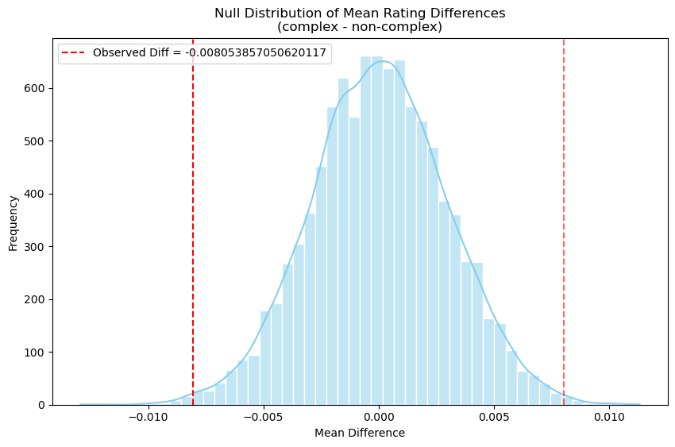

# Analyzing The Effect of Healthiness and Complexity of a Recipe on its Rating
A Final Project for DSC80
By Ananya Anand Wasker

## Introduction

This project takes an analytical look into the 'Recipes and Ratings' data in order to understand the factors that influence Internet recipes' average ratings. With more and more food and cooking content becoming widely accessible through online mediums like websites, blogs, TV shows, social media etc., I'm deeply curious about what kind of recipes get high ratings, and more importantly, can these ratings be predicted with knowledge about the recipe itself?

After looking through the two datasets and perusing the source website, I was interested particularly in two features: the nutritional content of the ingredients used in the recipe and the complexity of the recipe instructions. This is not only because healthy/unhealthy recipes or simpler/difficult recipes may be rated in a particular way by audiences, but because these features have a nuanced effect *on each other*. For example, does a healthy recipe being highly challenging to make get a lower rating than a healthy recipe that's much simpler? What about the ratings of an unhealthy recipe that's quick and easy to make?

Therefore, through data exploration, data analysis, hypothesis testing, and predictive modeling, I ultimately aim to answer the research question: **To what extent do nutritional healthiness and complexity of instructions influence recipe ratings, and can I build a model to predict recipe ratings based on the interaction between these two factors?** Working towards this research question can also aid in understanding real-world implications of society's changing attitudes to health, personalized recipe recommendations based on complexity preferences, and many other such use cases.

Let's introduce our data! We originally have two datasets, one with recipe information and one with rating information. While the recipes dataset has 83782 rows × 12 columns, the ratings dataset has 731927 rows × 5 columns. A description of the relevant columns is below.

### **Recipes Dataset**

| Column           | Data Type | Description                           |
|------------------|-----------|---------------------------------------|
| `name`           | object    | Recipe name                           |
| `id`             | int64     | Recipe ID                             |
| `minutes`        | int64     | Minutes to prepare recipe             |
| `tags`           | object    | Food.com tags for recipe              |
| `nutrition`      | object    | Nutrition information                 |
| `n_steps`        | int64     | Number of steps in recipe             |
| `steps`          | object    | Text for recipe steps, in order       |
| `n_ingredients`  | int64     | Number of ingredients                 |

---

### **Ratings Dataset**

| Column       | Data Type | Description          |
|--------------|-----------|----------------------|
| `recipe_id`  | int64     | Recipe ID            |
| `rating`     | int64     | Rating given         |


## Data Cleaning and Exploratory Data Analysis

### Mandatory Merging Step
In order to get information about the average ratings of each recipe, we left merge both datasets on id and recipe_id. We also drop duplicated rows and add average rating for each recipe.  

### Data Inspection

We inspected the data with ```.info()```, ```.describe()```, ```isnull()```. 

### Replacing Invalid Data Points With NaN

Now that we've looked at the different aspects and qualities of the data, we replaced any invalid values with ```NaN``` values. For example, the ```minutes``` column should not have ```0``` values as the recipe can't take 0 minutes to prepare. We did this similar checking by brainstorming other kinds of possible invalid values in other columns and replace NaN. For each column we inspected the ten shortest length values and check their validity, then implement replacements to NaN. We see that for the columns ```tags``` and ```steps```, the first row is invalid and any instances of these values in those columns needs to be replaced with NaN. Any instances of non-alphabetical strings in ```description``` or ```review``` should also be changed to NaN. For numeric columns, any cases of 0 must be replaced with NaN. Even if a data point might not make sense, like the ```minutes``` column having a ```1``` minute value, removing it would introduce selection bias as we don't have any gaurantee that the data point is invalid. Thus, we keep this kind of data.

### Creating New Columns

We see that our ```nutrition``` column is a string representation of a list. We split it in into different columns so we can analyze recipes' healthiness. These new columns are 'total_calories', 'fat_pdv', 'sugar_pdv', 'sodium_pdv',
'protein_pdv', 'sat_fat_pdv', 'carbs_pdv'. 

### Outlier Check

We used the InterQuartile-Range method to check for outliers in each numeric column. We inspected them to check that none of them are invalid values (negatives that go past the lower bound). From analysis, we see that the outliers here are not an issue. For example, even though the lower bound for the ```ratings``` column is 3.75, it is completely plausible that recipes get lower ratings than that. For the rest of the columns, we see from the above DataFrame that no values ever go past the lower bound. Since extremely high values are plausible outliers from the dataset, we can conclude that all invalid outliers have been removed. In this context, it does not make sense to apply transformations to the data to lower outlier counts, as they are plausible values that provide meaningful insights into the recipes and ratings data. Therefore, we conclude our outlier check here.

### Final DataFrame

Here is the cleaned ```merged``` dataset with relevant columns.

| name                                 |   minutes | tags                                                                                                                                                                                                                                                                                               | nutrition                                     |   n_steps |   n_ingredients |   avg_rating |   total_calories |   fat_pdv |   sugar_pdv |   sodium_pdv |   protein_pdv |   sat_fat_pdv |   carbs_pdv |
|:-------------------------------------|----------:|:---------------------------------------------------------------------------------------------------------------------------------------------------------------------------------------------------------------------------------------------------------------------------------------------------|:----------------------------------------------|----------:|----------------:|-------------:|-----------------:|----------:|------------:|-------------:|--------------:|--------------:|------------:|
| 1 brownies in the world    best ever |        40 | ['60-minutes-or-less', 'time-to-make', 'course', 'main-ingredient', 'preparation', 'for-large-groups', 'desserts', 'lunch', 'snacks', 'cookies-and-brownies', 'chocolate', 'bar-cookies', 'brownies', 'number-of-servings']                                                                        | [138.4, 10.0, 50.0, 3.0, 3.0, 19.0, 6.0]      |        10 |               9 |            4 |            138.4 |        10 |          50 |            3 |             3 |            19 |           6 |
| 1 in canada chocolate chip cookies   |        45 | ['60-minutes-or-less', 'time-to-make', 'cuisine', 'preparation', 'north-american', 'for-large-groups', 'canadian', 'british-columbian', 'number-of-servings']                                                                                                                                      | [595.1, 46.0, 211.0, 22.0, 13.0, 51.0, 26.0]  |        12 |              11 |            5 |            595.1 |        46 |         211 |           22 |            13 |            51 |          26 |
| 412 broccoli casserole               |        40 | ['60-minutes-or-less', 'time-to-make', 'course', 'main-ingredient', 'preparation', 'side-dishes', 'vegetables', 'easy', 'beginner-cook', 'broccoli']                                                                                                                                               | [194.8, 20.0, 6.0, 32.0, 22.0, 36.0, 3.0]     |         6 |               9 |            5 |            194.8 |        20 |           6 |           32 |            22 |            36 |           3 |
| millionaire pound cake               |       120 | ['time-to-make', 'course', 'cuisine', 'preparation', 'occasion', 'north-american', 'desserts', 'american', 'southern-united-states', 'dinner-party', 'holiday-event', 'cakes', 'dietary', 'christmas', 'thanksgiving', 'low-sodium', 'low-in-something', 'taste-mood', 'sweet', '4-hours-or-less'] | [878.3, 63.0, 326.0, 13.0, 20.0, 123.0, 39.0] |         7 |               7 |            5 |            878.3 |        63 |         326 |           13 |            20 |           123 |          39 |
| 2000 meatloaf                        |        90 | ['time-to-make', 'course', 'main-ingredient', 'preparation', 'main-dish', 'potatoes', 'vegetables', '4-hours-or-less', 'meatloaf', 'simply-potatoes2']                                                                                                                                             | [267.0, 30.0, 12.0, 12.0, 29.0, 48.0, 2.0]    |        17 |              13 |            5 |            267   |        30 |          12 |           12 |            29 |            48 |           2 |


### Univariate Analysis

Let's look at the distributions of our relevant variables, for example, ```tags```, ```n_steps```, ```n_ingredients```, ```avg_rating```, and the nutrition columns.

<iframe
  src="assets/top-tags.html"
  width="800"
  height="600"
  frameborder="0"
></iframe>

From this plot, we see the most frequent tags on recipes on food.com. Notable tags include 'easy', 'low-in-something', '60-minutes-or-less', '30-minutes-or-less', '3-steps-or-less'. This indicates that people tend to make recipes for easier, simpler dishes that are healthy and delicious, contributing to the high frequency of these recipes in the merged dataset. This is an interesting insight because it informs us of people's priorities / what kinds of recipes get the most traffic on food.com! Since we are looking into complexity of recipes, this is a helpful plot!

Now let's look at the distribution of nutritional content.

<iframe
  src="assets/log-nutritional-distributions.html"
  width="800"
  height="600"
  frameborder="0"
></iframe>

Here, we see visualizations of each of the nutritional columns. We employed the log scale because our data is heavily right-skewed due to the presence of outliers, as seen in the section before this. Doing the log-scale helps lower the effect of outliers in the visualizations. We also see that most histograms here are normally distributed, but have a uptick in 0 values for each nutrient. This high prevalance of 0 values in each column is to be expected because of the sheer variety of recipes and foods. Dessert recipes, of which there are bound to be many, are expected to have almost 0 protein and 0 carbohydrates present, while fried foods are expected to have almost 0 sugar present. These wildly different nutritional goals for each recipe are just a few examples that explain the high 0 values in each plot. Since we are looking into nutrition of foods, this is insightful information!

### Bivariate Analysis

We also investigated relationships between different variables that could help us uncover our research question.

<iframe
  src="assets/correlation-matrix.html"
  width="800"
  height="600"
  frameborder="0"
></iframe>

From the correlation matrix, we see lots of interesting relationships. Primarily, we see that ```total_calories``` is highly correlated with ```saturated fats```, ```fats```, ```sugars```. ```Carbohydrates``` in recipes are highly associated with ```sugar``` content in recipes. Meanwhile, we see that ```sugar``` is not highly correlated with ```protein``` content in foods, and both ```saturated fats``` and unsaturated ```fats``` are also not highly correlated with ```sodium``` in foods. From this matrix, we can extract that healthier recipes in this dataset will have higher ```protein``` content and lower ```sugar``` content, and therefore, an overall lower ```total_calories``` count. These are a few indicators that we can use later in the prediction model to map out the healthiness of recipes.

### Interesting Aggregates

| protein_bin    |   n_ingredients |   n_steps |   rating |
|:---------------|----------------:|----------:|---------:|
| Low Protein    |         7.6483  |   8.47094 |  4.6956  |
| Medium Protein |         9.19655 |  10.1598  |  4.67908 |
| High Protein   |        10.4035  |  11.4596  |  4.66452 |

This shows us that high protein recipes, on average, have high number of ingredients and high number of steps, but a lower average rating. On the other hand, low protein recipes, on average, have the least number of steps and ingredients required to make them but have the highest average rating. Since protein is a proxy for healthiness in recipes, this points towards healthy recipes being slightly more complex and more healthy, but ultimately getting comparitively lower ratings.

## Assessment of Missingness

### NMAR Analysis

In order for a column to be NMAR (not missing at random), we need to make sure that NMAR is the main reason the data is missing. In other words, the chances of a value missing must be primarily dependent on the value itself. 

In this dataset, I believe that the ```review``` column is NMAR because the chance that data is missing in this column may be because of the data point itself. Most people only give reviews if they really enjoyed or liked something. For example, on the App Store, most reviews we see are positive because people who really benefitted from an app want to show their appreciation and love to the app's creator and are willing to take the effort to think of things to say, type them, and submit them. In the same fashion, users on food.com may only be inclined to leave a written review if they really enjoyed a recipe, and would usually skip giving unkind / so-so reviews to a recipe purely due to indifference or lack of interest to make the effort and submit a written review. 

### Missingness Dependency

Now, let's look at the missingness dependency of the column that has the most missing values: ```rating```. We check if the chances that a value is missing in ```rating``` could be dependent on other columns, particularly ```n_steps```, ```minutes```, and ```total_calories```, as these columns are relevant to our research question and project. These are the steps we'll follow to check if ```rating``` is MAR (missing at random) on these columns:

- Create new column that contains True values if ```rating``` in that row is missing, and False if not.
- Create permutation test function that can be applied to the three columns.
    1. There are two probability distributions of the feature column (say, ```n_steps```). One is when ```rating``` is missing, and the other is where ```rating``` is not missing. Compute the absolute difference in means between these two distributions, and this is our observed test statistic.
    2. Now, randomly shuffle the new column, ```rating_missing```, to simulate our null hypothesis, assigning Trues and Falses to random rows. Do this shuffling simulation ```n``` times, and add all computed absolute difference in means to one array.
    3. Then, check the distribution of all these absolute difference in means values in the array and plot the observed absolute difference in means value in this plot. This will give you an idea of whether the observed value is consistent with the null hypothesis or is evidence enough to reject the null.
    4. Lastly, compute p-value, which is the proportion of simulated absolute difference in means under null that are more extreme than the observed absolute difference in means. If the value is below 0.05 (our signficance level), our observed absolute difference in means is statistically significant, and therefore we can reject the null hypothesis that ```rating``` missingness is not dependent on the feature column (in this case, ```n_steps```).

<iframe
  src="assets/perm.html"
  width="800"
  height="600"
  frameborder="0"
></iframe>

From the distribution, we can see that missingness of rating likely depends on n_steps. This is because the p-value is extremely small in this case, and is less than the significance level of 0.05.

We do this twice for two other variables, and find that rating missingness is likely dependent on total_calories but not on minutes. We then performed conditional probabilistic imputation to fill in the ratings column appropriately.


## Hypothesis Testing

In keeping with our research question, let's perform hypothesis testing to investigate if complexity of a recipe affects people's ratings. Here, we do a two-sided permutation test to check if both samples come from the same population or not. In other words, we're trying to understand if there's a significant difference in the way that people rate complex and simple dishes. This is why we use permutation testing.

**Null Hypothesis** : There is no difference in the average recipe ratings between complex and non-complex recipes.

**Alternative Hypothesis** : There is a difference in the average recipe ratings between complex and non-complex recipes.

**Test Statistic** : Difference in Means

Here, we define ```is_complex``` by looking at ```n_steps```, ```n_ingredients```, and ```minutes``` together. First we standardize this data and compute the average as the ```complexity score``` of a recipe. Then, we take the median ```complexity score``` as the threshold and recipes whose score is higher than this median are considered complex. These indicators together give us a holistic understanding of the complexity of a recipe by taking into account the factors that people might consider time-consuming, lots-of-effort etc. 



After doing hypothesis testing, we see that our observed test statistic was statistically significant and therefore, we can reject the null hypothesis that there is no difference in average ratings between complex and non complex recipes. In fact, complex recipes tend to have a lower rating average when compared to simpler recipes. Since our p-value (0.0068) is below the significance level of 0.05, we can say that the difference in means between the two groups is unlikely due to random chance. This suggests that users tend to rate simpler recipes slightly higher than more complex ones, maybe reflecting preferences for ease of preparation or clarity of instructions, along with lesser cook times, less effort, less ingredients to buy. However, it is important to note that complexity here was defined by our own terms, where we took median as the threshold. In conclusion, our dataset suggests that recipe complexity does indeed influence the ratings people submit! These findings will inform our prediction model!

## Framing a Prediction Problem

Based on the past sections, we've found that healthiness and complexity of recipes both play a role in their ratings, and thus, **we will create a prediction model that recipe features to predict its average rating**. We plan to predict the average rating of a recipe (1,2,3,4 or 5) based on features particularly relating to its healthiness and complexity. We will need to build a multi-class classifer since we are trying to predict ordinal categories. 

We choose our target variable to be ```average rating``` because it is highly indicative of the quality of a recipe as percieved by the thousands of users on food.com. This is useful information not only for users and recipe creators, but also preserves the ordinal ranking of 1 star recipes being percieved as lower quality than 5 star recipes.

Here, we choose the **F1 Score** as our evaluation metric because our dataset is highly skewed towards 4 stars and 5 stars ratings, leading to severe class imbalance for our prediction model. Accuracy, therefore, will be misleading because it will not appropriately account for the underrepresented classes and may instead give us an artificial view of high performance. On the other hand, **F1 Score** computes the indiviual F1 Score for all classes and averages them, showing us the model performance across all categories. This is helpful as it balances precision and recall, ensuring predictions for *all* classes are good / improving, not only the predictions for our majority class.  

## Baseline Model

Our baseline model is a Random Forest classifier trained to predict the average recipe rating rounded to the nearest integer (1 through 5). Therefore, the prediction task is a multiclass classification problem with five possible ordinal rating categories. 

The features we use are listed below:
- ```n_steps``` : the number of steps needed to execute the recipe (quantitative, representative of complexity).
- ```total_calories``` : total calorie content of recipe (quantitative, representative of healthiness).
- ```is_complex``` : a boolean feature indicating whether recipe's complexity score is greater than median (nominal, representative of complexity). The creation and justification of the ```is_complex``` feature is described in detail in the **Hypothesis Testing** section of this notebook.

Feature Processing steps included:
- ```n_steps``` and ```total_calories``` were standardized using ```StandardScaler``` to make sure that the different scales didn't negatively affect model performance and that interpretability was improved. This isn't mandatory for our classifier but helps with a consistent pipeline.
- ```is_complex``` is a binary categorical feature, so we used ```OneHotEncoding``` to convert it into a numerical format that the model can understand use in its analysis and prediction. We also make sure to drop the redundant columns to reduce multicollinearity. 

Model Training and Evaluation:
- We split the dataset into the training and testing set an 80-20 ratio, and used stratified sampling based on the target variable of ```rounded_rating```. This sampling preserved the original class imbalance and qualities of the dataset in the 2 subsets.
- By using a single ```ColumnTransformer Pipeline```, we processed the input features and ran the Random Forest classifier.

Result Analysis and Final Consensus:
- We see below that our while our accuracy is 0.88, our macro F1 Score is 0.57. This confirms that accuracy overstates the performance by favoring the results of majority classes, while F1 Scores take into account the model's performance on all classes, giving each class importance. Since the 4 and 5 ratings dominate the dataset, our F1 scores for those classes are 0.77 and 0.92, respectively. However, our performance drops with the rest of the ratings that are underrepresented in the data, with the F1 Scores for 1, 2, and 3 ratings being 0.19, 0.47, and 0.52 respectively. This means that we have low recall and low precision in predicting these classes, i.e, we miss recipes with lower ratings and we incorrectly predict a low rating for recipes.
- Our model has demonstrated that while it can reasonably predict high ratings for recipes, it fails to match this performance in predicting lower ratings. From the analysis of F1 Scores above and the disparity between classes, we see that there is certainly room for improvement and that it has not yet reached its potential to be a 'good' model.

## Final Model

In order to improve on the baseline model, these are the changes we made.

Feature Engineering
- To expand on our definition of healthiness and complexity and their effect on recipe ratings, we included ```protein_pdv``` to complement the ```total_calories``` and added the ```n_steps```, ```n_ingredients```, ```minutes``` to complement our categorical feature ```is_complex``` (which could only take on 0 or 1 values).
- These features give us a more in-depth understanding of the cooking effort as well as the various nutritional aspects that go into creating a recipe.

Final Model
- ```Integrated Imbalanced-Learn's Pipeline``` so we could use ```SMOTE``` (Synthetic Minority Oversampling Technique), which helps mitigate our problem of having ratings concentrated around 4 and 5. SMOTE reduces the class imbalance by artifically generating new samples from the minority class so that the model gets better at recognizing the features of 1-3 star ratings.
- We will tune hyperparameters to improve the model and this is how:
    1. ```n_estimators```: More trees usually improve performance because the model is able to capture the interactions and relationships between our features (which is something we wanted to consider to understand healthiness vs complexity). Since we have many features now, we should increase it from 100 to close to 300 since our dataset is quite large.
    2. ```max_depth```: Instead of max_depth being None and risking overfitting, we want to test across a range of tree depths and find the limit before performance becomes stagnant. We can do this by going up to 50 in increments of 10. Perhaps with this, we can strike a balance between underfitting and overfitting.
    3. ```min_samples_split```: Since a lower minimum value allows the tree to split with less data, risking overfitting or learning wrong patterns, we should test this with higher numbers. Therefore, we can pick a range from 2 - 10.
    4. ```min_samples_leaf```: The default is 1, but this means leaves can represent only one sample. For such a large dataset, we should test on different values of this hyperparameter as well, like we've done above. So, let's test for a range from 1 - 4.
    5. ```class_weight```: Lastly, because our dataset is heavily imbalanced in terms of classes, we set class_weight to 'balanced' and give the minority classes more importance. We can also add balanced_subsample to improve the weights for each sample of the minority class. This reinforces the effects of SMOTE and tuning this will hopefully prevent underperforming on minority classes like the baseline model did!


The final model shows a clear improvement over the baseline in both the macro F1 score and the individual class-level F1 scores, which is what we were aiming for. The macro F1 score increased from 0.574 in the baseline model to 0.639 in the final model, indicating a more balanced performance across all rating classes, especially the underrepresented classes. For individual classes, the F1 score for class 1 (the most underrepresented) improved from 0.19 to 0.23, and for class 2, it jumped from 0.47 to 0.57, showing enhanced ability to handle less frequent ratings. Class 3 improved from 0.52 to 0.61, while class 4, which has a large number of samples, saw its F1 score rise from 0.77 to 0.84. Class 5 saw a slight improvement from 0.92 to 0.94. These improvements demonstrate that the final model, which was built on the baseline model and then enhanced through feature expansion, SMOTE oversampling, and hyperparameter tuning, not only improved accuracy on the majority classes but also addressed class imbalance more effectively, leading to more reliable predictions.


## Fairness Analysis

Lastly, we tested if our model is fair for different groups. To keep up with our project theme, we checked if the model works equally well for complex versus simple recipes, as defined by our self-created complexity_score. Let's define the hypotheses below:

**Null Hypothesis** : Our model is fair. It's ability to balance precision and recall (its F1 Score) is roughly the same, and variations can be explained by chance.

**Alternative Hypothesis** : Our model is not fair. It's ability to balance precision and recall (its F1 Score) is not the same between groups, and variations and differences here cannot solely be explained by chance.

**Test Statistic** : Difference in Macro F1 Scores. We use this test-statistic because we want to see if the model's performance on all categories (in this case, ratings) changes between complex and non-complex recipes. This effectiveness in predicting for all groups is how we evaluate our model, and should therefore be used to determine fairness for different groups. If the difference in scores, for example, is close to 0, then we see that our model is roughly fair. But for this, we must conduct permutation testing.

Below is the null distribution of test-statistics (F1 score of simple recipes - F1 score of complex recipes), alongside our observed test-statistic in our dataset.


In conlusion, since this p-value is well above the significance level of 0.05, we fail to reject the null hypothesis. This indicates that the observed performance difference can be attributed to random chance, and thus, we do not have sufficient evidence to conclude that the model is unfair or biased in its predictions across recipe complexity groups. Overall, the model appears to perform equitably between simple and complex recipes. Thank you!